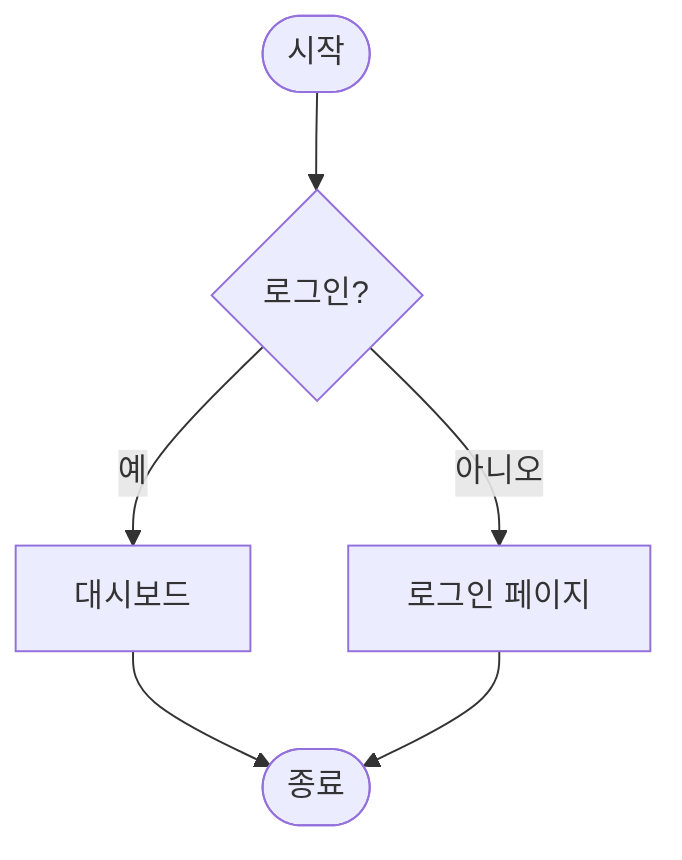

# README.md 파일 작성
## ai를 활용한 백엔드 개발
**중요해** <br>


<hr>

---


```markdown
# Simple Calculator (Java Swing)

**Proper Calculator** — Java Swing으로 제작된 깔끔하고 현대적인 GUI 계산기입니다.

---

## 📌 프로젝트 소개

이 프로젝트는 Java Swing을 활용하여 만든 **기본 사칙연산 계산기**입니다.  
사용자 친화적인 디자인, 예외 처리, 버튼 스타일링, 반응형 레이아웃 등을 중점으로 구현하였습니다.

### 주요 기능
- **덧셈, 뺄셈, 곱셈, 나눗셈** 지원
- 실수(double) 계산 지원
- 0으로 나누기 오류 처리
- 잘못된 입력(문자 등) 예외 처리
- 깔끔한 UI 디자인 (색상 테마, 폰트, 여백 적용)
- 결과값을 소수점 2자리까지 표시

---

## 🗂 프로젝트 구조
SimpleCalculator/
├── src/
│   └── test/
│       └── SimpleCalculator.java     # 메인 클래스 (전체 코드)
├── README.md
├── .gitignore                        # (선택)
└── bin/                              # 컴파일 후 생성되는 폴더 (IDE 자동 생성)
    └── test/
        ├── SimpleCalculator.class
        └── ... (기타 클래스 파일)
```

> **단일 파일 프로젝트**로 구성되어 있어 별도의 패키지 관리가 필요 없습니다.

---

## 🚀 실행 방법

### 1. 컴파일 및 실행 (터미널 / CMD)

```bash
# 컴파일
javac -d . src/test/SimpleCalculator.java

# 실행
java test.SimpleCalculator
```

### 2. IDE 사용 시
- IntelliJ IDEA, Eclipse, VS Code 등에서 `SimpleCalculator.java`를 열고 **Run** 버튼 클릭
- Java 8 이상 권장

---

## 📄 전체 소스 코드

```java
package test;

import javax.swing.*;
import java.awt.*;
import java.awt.event.ActionEvent;
import java.awt.event.ActionListener;

public class SimpleCalculator extends JFrame implements ActionListener {

    private JTextField num1Field;
    private JTextField num2Field;
    private JLabel resultLabel;

    private JButton addBtn;
    private JButton subtractBtn;
    private JButton multiplyBtn;
    private JButton divideBtn;

    public SimpleCalculator() {
        // Frame setup
        setTitle("Proper Calculator");
        setSize(400, 350);
        setDefaultCloseOperation(JFrame.EXIT_ON_CLOSE);
        setLocationRelativeTo(null);

        // Main panel
        JPanel mainPanel = new JPanel(new BorderLayout(10, 10));
        mainPanel.setBackground(new Color(230, 230, 230));

        // Title Panel
        JPanel titlePanel = new JPanel(new FlowLayout(FlowLayout.CENTER, 10, 10));
        titlePanel.setBackground(new Color(50, 50, 50));
        JLabel titleLabel = new JLabel("CALCULATOR");
        titleLabel.setFont(new Font("Arial", Font.BOLD, 28));
        titleLabel.setForeground(Color.WHITE);
        titlePanel.add(titleLabel);
        mainPanel.add(titlePanel, BorderLayout.NORTH);

        // Center Container
        JPanel centerContainerPanel = new JPanel(new BorderLayout(10, 10));
        centerContainerPanel.setBackground(new Color(230, 230, 230));

        // Input Panel
        JPanel inputPanel = new JPanel(new FlowLayout(FlowLayout.CENTER, 10, 10));
        inputPanel.setBackground(Color.WHITE);

        num1Field = new JTextField(10);
        num2Field = new JTextField(10);

        Dimension textFieldSize = new Dimension(120, 35);
        Font textFieldFont = new Font("Arial", Font.PLAIN, 16);
        Color borderColor = new Color(180, 180, 180);

        num1Field.setPreferredSize(textFieldSize);
        num1Field.setFont(textFieldFont);
        num1Field.setBorder(BorderFactory.createCompoundBorder(
            BorderFactory.createLineBorder(borderColor, 1),
            BorderFactory.createEmptyBorder(5, 5, 5, 5)
        ));

        num2Field.setPreferredSize(textFieldSize);
        num2Field.setFont(textFieldFont);
        num2Field.setBorder(BorderFactory.createCompoundBorder(
            BorderFactory.createLineBorder(borderColor, 1),
            BorderFactory.createEmptyBorder(5, 5, 5, 5)
        ));

        inputPanel.add(new JLabel("Number 1:"));
        inputPanel.add(num1Field);
        inputPanel.add(new JLabel("Number 2:"));
        inputPanel.add(num2Field);

        centerContainerPanel.add(inputPanel, BorderLayout.NORTH);

        // Button Panel
        JPanel buttonPanel = new JPanel(new GridLayout(2, 2, 10, 10));
        buttonPanel.setBackground(new Color(230, 230, 230));

        addBtn = new JButton("+");
        subtractBtn = new JButton("-");
        multiplyBtn = new JButton("*");
        divideBtn = new JButton("/");

        Dimension buttonSize = new Dimension(60, 40);
        Font buttonFont = new Font("Arial", Font.BOLD, 20);
        Color buttonBgColor = new Color(70, 130, 180);
        Color buttonFgColor = Color.WHITE;

        applyButtonStyle(addBtn, buttonBgColor, buttonFgColor, buttonSize, buttonFont);
        applyButtonStyle(subtractBtn, buttonBgColor, buttonFgColor, buttonSize, buttonFont);
        applyButtonStyle(multiplyBtn, buttonBgColor, buttonFgColor, buttonSize, buttonFont);
        applyButtonStyle(divideBtn, buttonBgColor, buttonFgColor, buttonSize, buttonFont);

        buttonPanel.add(addBtn);
        buttonPanel.add(subtractBtn);
        buttonPanel.add(multiplyBtn);
        buttonPanel.add(divideBtn);

        centerContainerPanel.add(buttonPanel, BorderLayout.CENTER);
        mainPanel.add(centerContainerPanel, BorderLayout.CENTER);

        // Result Panel
        JPanel resultPanel = new JPanel(new FlowLayout(FlowLayout.CENTER, 10, 10));
        resultPanel.setBackground(new Color(70, 130, 180));
        resultLabel = new JLabel("Result: ");
        resultLabel.setFont(new Font("Arial", Font.BOLD, 18));
        resultLabel.setForeground(Color.WHITE);
        resultPanel.add(resultLabel);
        mainPanel.add(resultPanel, BorderLayout.SOUTH);

        add(mainPanel);
    }

    private void applyButtonStyle(JButton button, Color bgColor, Color fgColor, Dimension size, Font font) {
        button.setPreferredSize(size);
        button.setBackground(bgColor);
        button.setForeground(fgColor);
        button.setFont(font);
        button.setBorder(BorderFactory.createRaisedBevelBorder());
        button.setFocusPainted(false);
        button.addActionListener(this);
    }

    @Override
    public void actionPerformed(ActionEvent e) {
        try {
            double num1 = Double.parseDouble(num1Field.getText().trim());
            double num2 = Double.parseDouble(num2Field.getText().trim());
            double result = 0;
            String operation = ((JButton) e.getSource()).getText();

            switch (operation) {
                case "+": result = num1 + num2; break;
                case "-": result = num1 - num2; break;
                case "*": result = num1 * num2; break;
                case "/":
                    if (num2 == 0) {
                        resultLabel.setText("Error: Divide by zero");
                        resultLabel.setForeground(Color.RED);
                        return;
                    }
                    result = num1 / num2;
                    break;
            }
            resultLabel.setText("Result: " + String.format("%.2f", result));
            resultLabel.setForeground(Color.WHITE);

        } catch (NumberFormatException ex) {
            resultLabel.setText("Error: Invalid input");
            resultLabel.setForeground(Color.RED);
        } catch (Exception ex) {
            resultLabel.setText("Error: An unexpected error occurred");
            resultLabel.setForeground(Color.RED);
            ex.printStackTrace();
        }
    }

    public static void main(String[] args) {
        SwingUtilities.invokeLater(() -> {
            SimpleCalculator calculator = new SimpleCalculator();
            calculator.setVisible(true);
        });
    }
}
```

---

## 📚 주요 개념 설명

### 1. **Swing GUI 라이브러리**
Java에서 데스크톱 GUI 애플리케이션을 만들기 위한 표준 라이브러리입니다.

### 2. **레이아웃 매니저 (Layout Manager)**
- `BorderLayout`: North, Center, South 영역 배치
- `FlowLayout`: 좌→우 흐름 배치 (입력 필드)
- `GridLayout`: 격자 형태 버튼 배치 (2×2)

### 3. **이벤트 처리**
- `ActionListener` 인터페이스 구현
- `actionPerformed(ActionEvent e)` 메서드 오버라이딩
- `e.getSource()`로 클릭된 버튼 구분

### 4. **예외 처리 (Exception Handling)**
- `NumberFormatException`: 숫자가 아닌 입력 처리
- 0으로 나누기 예외 별도 처리

### 5. **SwingUtilities.invokeLater()**
**Event Dispatch Thread (EDT)**에서 GUI를 생성하여 스레드 안전성 확보

---

## 🔗 참고 자료

- [Oracle Java Swing Tutorial](https://docs.oracle.com/javase/tutorial/uiswing/)
- [Java Swing 레이아웃 매니저 가이드](https://www.javatpoint.com/java-swing-layouts)
- [BorderLayout 설명](https://docs.oracle.com/javase/tutorial/uiswing/layout/border.html)
- [Java GUI Best Practices](https://www.baeldung.com/java-swing-best-practices)
- [Java Swing Color Codes](https://www.color-hex.com/)

---

**Made with ❤️ using Java Swing**

궁금한 점이나 개선 사항이 있으면 언제든 Issue나 Pull Request를 남겨주세요!
```

이 README.md를 그대로 복사해서 프로젝트 루트에 `README.md` 파일로 저장하시면 됩니다. 필요하면 이미지(스크린샷)도 추가해서 더 멋지게 꾸밀 수 있어요!
